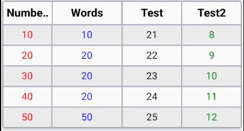

# `rn-fully-responsive-table`

Fully responsive and customizable react native table-grid components

## Getting started

Install the library using either Yarn:

```
yarn add rn-fully-responsive-table
```

or npm:

```
npm install rn-fully-responsive-table
```

***If you have multiple header, your header value should be same with given data properties key for each column.***


## Usage

```js
import { ResponsiveTable } from 'rn-fully-responsive-table';
// ...

const multiHeader = ['Numbers', 'Words'];
const multiHeaderData = [
  { Numbers: 1, Words: '11' },
  { Numbers: 2, Words: '22' },
  { Numbers: 2, Words: '22' },
];
// ...

<ResponsiveTable columnsCustomization={multiHeader} dataSource={multiHeaderData} />

// ...
```

# Screen Shots <br>


### Types

#### `tableHeight`: number => Height of the table

#### `columnsCustomization`: string[] || columnProperties  => If you want customize the table with color or width <br>, you need the use columnProperties object. If you want a use multiHeader with same styling, you can use like

#### `dataSource`: [] => Data of the table

#### `containerStyle`: ViewStyle (React Native) => Style of the main container

#### `renderOnlyItems`: boolean => Show the table's header area or not. Default is true

#### `tableWidthMultiplier`: number (0.1 to 1) => Width of the table. (Value will multiplier with device width)

#### `colorPalet`: [ColorValue, ColorValue?] => Colors palet to use different color on the table. First color will be used <br> for id == 0 and second color will be used for id == 1, if you want use only one color, you can write one color to color array. Like ["red"]

#### `headerWrapperStyle`: ViewStyle (React Native) => Header Container styles

#### `headerTextStyle`: HeaderTextStyle => Header texts styles

#### `inlineItemStyle`: InlineItemStyle => Values text styles

```js
type columnProperties = {
  header: string;
  width: number;
  valueColor?: ColorValue; // colums value's color.
};

type HeaderTextStyle = {
  fontSize?: number;
  fontWeight?: 'bold' | '100' | '200' | '400' | '800';
  color?: ColorValue;
  textAlign?: 'center' | 'left' | 'right';
  padding?: number;
  paddingTop?: number;
  paddingLeft?: number;
  paddingBottom?: number;
  paddingRight?: number;
  borderRadius?: number;
  borderWidth?: number;
  borderColor?: ColorValue;
};

type InlineItemStyle = HeaderTextStyle & BorderStyle;
```

# Sample Tables

### SingleHeader Table <br>


```js
const singleHeader = ['Numbers'];
const singleHeaderData = ['1', '2', '3'];

MultiHaderTable =
Sample Data = 
const multiHeader = ['Numbers', 'Words'];
const multiHeaderData = [
  { Numbers: 1, Words: '11' },
  { Numbers: 2, Words: '22' },
  { Numbers: 2, Words: '22' },
];
```

### CustomizedMultiHeader <br>



```js
const customizedMultiHeader = [
  { header: 'Numbers', width: 2, valueColor: 'red' },
  { header: 'Words', width: 3, valueColor: 'blue' },
  { header: 'Test', width: 2.5 },
  { header: 'Test2', width: 2.5, valueColor: 'green' },
];

const customizedMultiHeaderItem = [
  { Numbers: 10, Words: '10', Test: '21', Test2: '8' },
  { Numbers: 20, Words: '20', Test: '22', Test2: '9' },
  { Numbers: 30, Words: '20', Test: '23', Test2: '10' },
  { Numbers: 40, Words: '20', Test: '24', Test2: '11' },
  { Numbers: 50, Words: '50', Test: '25', Test2: '12' },
];
```

# Another Examples

You can customize header background, text color, inline items text color and background for grids.


```js
<ResponsiveTable
 headerWrapperStyle={{ backgroundColor: 'white' }}
 inlineItemStyle={{ color: 'white' }}
 headerTextStyle={{ color: 'black' }}
 colorPalet={['gray', 'green']}
 columnsCustomization={multiHeader}
 dataSource={multiHeaderData}
/>
```

You can give table a height. Scrollview is already included the package. You can scroll the bottom.


```js
<ResponsiveTable 
 tableHeight={120} 
 columnsCustomization={customizedMultiHeader} 
 dataSource={customizedMultiHeaderItem} 
/>
```

## Author: https://www.linkedin.com/in/atakan-atabeyoglu/ <br>

## License

MIT

---

Made with [create-react-native-library](https://github.com/callstack/react-native-builder-bob)
